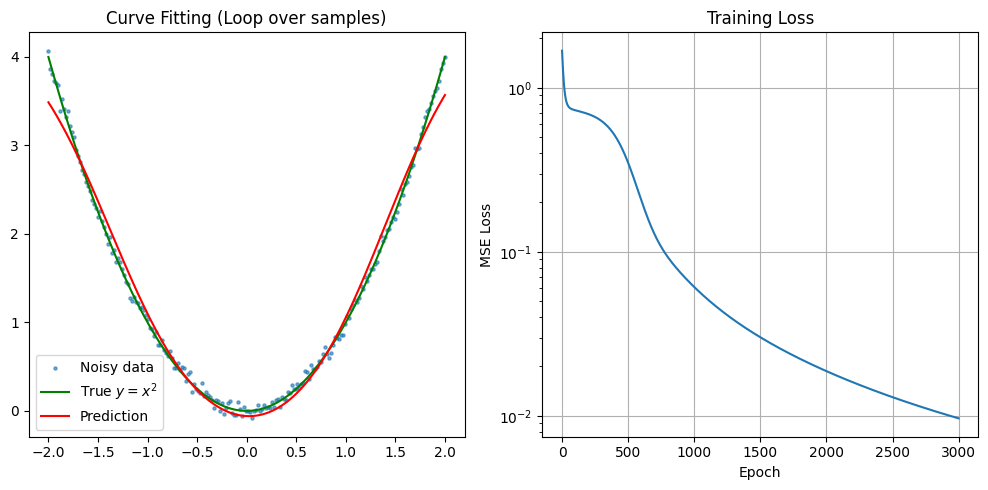
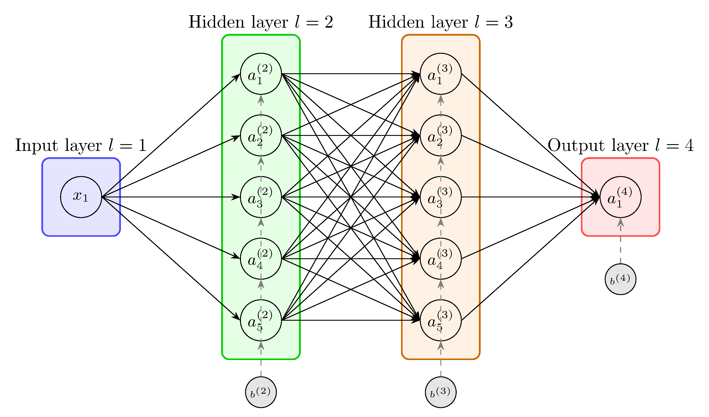
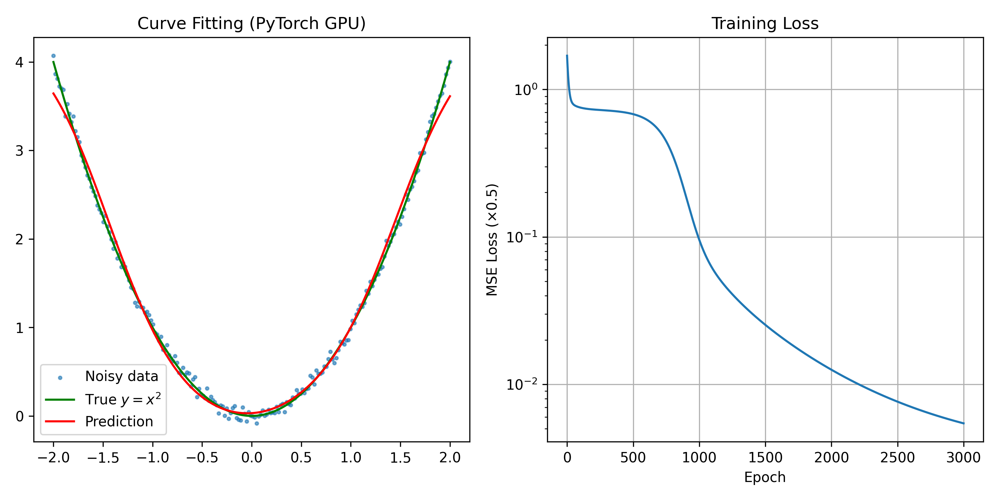

# 神经网络从零实现 —— 曲线拟合  🌐[English Version](README_English.md)

本项目先使用纯 NumPy 实现了一个多层全连接神经网络，**不依赖任何深度学习框架**（如 PyTorch、TensorFlow）。通过反向传播（Backpropagation）和批量梯度下降（Batch Gradient Descent）训练网络，用于拟合带噪声的二次函数 $y = x^2$ ，旨在完全**打开“黑箱”**，展示神经网络的拟合能力与底层实现细节。

随后使用 **PyTorch** 重写了相同的网络结构、训练策略和数据生成过程，并利用 GPU 加速（支持 CPU 回退）。两种实现均得到几乎一致的训练损失和拟合曲线，可作为学习神经网络底层原理与框架使用的对比参考。

---

## 📁 文件夹内容

- curve_fitting.ipynb：完成该项目的python代码
- output.png：numpy结果图、 output_torch.png：Pytorch结果图
- NN1551.png：该项目用到的神经网络的示意图
- drawNN1551.tex：绘制示意图的latex代码
- NNBJ.pdf：个人学习笔记（中文）
- CurveFitting_torch.py 用pytorch重写该项目的代码
---

## 📌 任务介绍

我们生成 200 个样本点，输入 $x$ 在 $[-2, 2]$ 区间内均匀分布，真实输出为  

$$
y_{\text{true}} = x^2
$$

并添加均值为 0、标准差为 0.05 的高斯噪声，得到训练数据 $(x, y)$ 。目标是训练一个神经网络，使其能够从带噪数据中学习到潜在的二次函数关系。

---

## 🧠 算法原理

### 网络结构

网络采用 **全连接前馈** 结构，层数为 4（输入层 + 2 个隐藏层 + 输出层）：

- 输入层：1 个神经元  
- 隐藏层 1：5 个神经元（激活函数： $\tanh$ ）  
- 隐藏层 2：5 个神经元（激活函数： $\tanh$ ）  
- 输出层：1 个神经元（激活函数：恒等 $\text{identity}$ ）

### 前向传播

设网络共有 $L$ 层，第 $l$ 层神经元个数为 $N_l$ 。输入层可视为第 0 层，其输出为 $a_i^{(0)} = x$ 。  
对于第 $l$ 层（ $l = 1, \dots, L$ ），第 $i$ 个神经元的加权输入和激活输出分别为：

$$
z_i^{(l)} = \sum_{j=1}^{N_{l-1}} w_{ij}^{(l)} a_j^{(l-1)} + b_i^{(l)}, \qquad a_i^{(l)} = \sigma_l(z_i^{(l)})
$$

其中 $\sigma_l$ 为第 $l$ 层的激活函数（隐藏层使用 $\tanh$ ，输出层使用恒等函数，即 $\sigma_L(z)=z$ ）。

### 损失函数

对于单个样本 $(x, y)$ ，采用均方误差的一半：

$$
\mathcal{L} = \frac{1}{2} \left( y - a^{(L)} \right)^2
$$

（此处输出层只有一个神经元，故 $a^{(L)}$ 为标量。）

### 反向传播（分量形式）

定义误差项：

$$
\delta_i^{(l)} = \frac{\partial \mathcal{L}}{\partial z_i^{(l)}}
$$

#### 1. 输出层误差

$$
\boxed{\delta_i^{(L)} = \frac{\partial \mathcal{L}}{\partial a_i^{(L)}} \, \sigma_L'(z_i^{(L)})}
$$

对于平方损失， $\frac{\partial \mathcal{L}}{\partial a_i^{(L)}} = -(y_i - a_i^{(L)})$ ，且 $\sigma_L'(z)=1$ ，故（本任务中 $y_i$ 为标量 $y$ ）：

$$
\delta^{(L)} = -(y - a^{(L)})
$$

#### 2. 误差反向传播（ $l = L-1, L-2, \dots, 1$ ）

$$
\boxed{\delta_i^{(l)} = \left( \sum_{k=1}^{N_{l+1}} \delta_k^{(l+1)} w_{ki}^{(l+1)} \right) \sigma_l'(z_i^{(l)})}
$$

#### 3. 权重梯度

$$
\boxed{\frac{\partial \mathcal{L}}{\partial w_{ij}^{(l)}} = \delta_i^{(l)} a_j^{(l-1)}}
$$

#### 4. 偏置梯度

$$
\boxed{\frac{\partial \mathcal{L}}{\partial b_i^{(l)}} = \delta_i^{(l)}}
$$

### 多样本训练（批量梯度下降）

设有 $M$ 个训练样本，总损失为各样本损失的平均值：

$$
\mathcal{L}_{\text{total}} = \frac{1}{M} \sum_{k=1}^{M} \mathcal{L}^{(k)}
$$

总梯度为各样本梯度的平均值，参数更新规则为：

$$
w_{ij}^{(l)} \leftarrow w_{ij}^{(l)} - \eta \cdot \frac{1}{M} \sum_{k=1}^{M} \frac{\partial \mathcal{L}^{(k)}}{\partial w_{ij}^{(l)}}, \quad b_i^{(l)} \leftarrow b_i^{(l)} - \eta \cdot \frac{1}{M} \sum_{k=1}^{M} \frac{\partial \mathcal{L}^{(k)}}{\partial b_i^{(l)}}
$$

其中 $\eta$ 为学习率。

### 权重初始化

采用 **Xavier 初始化**（适用于 $\tanh$ 激活），使各层输出的方差保持相近：

$$
\text{scale} = \sqrt{\frac{2}{N_{\text{in}} + N_{\text{out}}}}, \quad w_{ij}^{(l)} \sim \mathcal{N}(0, \text{scale}^2), \quad b_i^{(l)} = 0
$$

其中 $N_{\text{in}}$ 和 $N_{\text{out}}$ 分别为当前层的输入和输出神经元个数。

---

## 📁 代码结构

代码按功能分为以下几个部分：

1. **数据生成**  
   - 使用 `np.linspace` 生成均匀分布的 $x$  
   - 计算真实值并添加高斯噪声，生成训练集。

2. **网络结构与参数初始化**  
   - 定义层数 `config = [1,5,5,1]`  
   - 使用 Xavier 初始化权重和偏置，存储于列表 `W` 和 `b` 中。

3. **激活函数及其导数**  
   - 定义 $\tanh$ 、 $\text{identity}$ 及其导数，并放入列表以便按层调用。

4. **训练循环（核心）**  
   - 对每个 epoch：
     - 遍历所有样本，执行前向传播，计算损失。
     - 执行反向传播，计算每个样本的梯度，累加到全局梯度变量中。
     - 使用平均梯度更新网络参数（批量梯度下降）。
   - 记录平均损失，并定期打印。

5. **预测与可视化**  
   - 使用训练后的网络对密集的 $x$ 点进行预测。
   - 绘制散点图（带噪数据）、真实曲线和预测曲线。
   - 绘制训练损失曲线（对数坐标），观察收敛情况。

---

## 🚀 如何使用

### 环境要求

- Python 3.x
- NumPy
- Matplotlib
- 额外依赖（PyTorch 版本）PyTorch 1.8+（并支持 CUDA 设备）

### 运行方式

ipynb文件，下载后在Jupyter 或 IDE 中运行
py文件，下载后在 IDE 运行或 直接使用终端 

## 📊 结果展示

训练 3000 个 epoch 后，网络能够较好地从带噪数据中恢复出 $y = x^2$ 的曲线，损失稳定下降至较低水平。预测曲线（红色）与真实曲线（绿色）基本重合，证明了神经网络的拟合能力。纯numpy结果见本README最开头的图片，以下为Pytorch的结果图。

*（运行代码后即可看到可视化结果）*

---

## 📦 依赖项

- `numpy` ：矩阵运算与数值计算
- `matplotlib` ：数据可视化

安装方式：
pip install numpy matplotlib

 

## 📝 备注
- 代码中使用了 np.einsum 进行矩阵乘法，清晰且高效，便于理解。

- 所有梯度累积和参数更新均在 NumPy 数组上完成，无任何自动微分工具，完全手动实现反向传播。

- 本项目可作为学习神经网络底层原理的入门示例，欢迎 Fork 和 Star！
